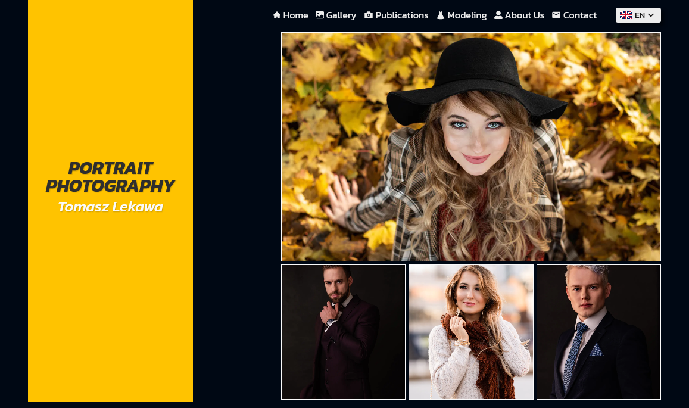

# Tomasz Lekawa Photography Portfolio Website

This is a freelance project designed and developed by myself. Tomasz Lekawa is a photographer based in Nottingham and I had a great pleasure to work on his new website with a focus on showcasing his past and recent work aswell as bring new clients to his business.

At the moment it's still waiting for client to update the content, as the website handover happened just few days ago.

## Table of contents

- [Tomasz Lekawa Photography Portfolio Website](#tomasz-lekawa-photography-portfolio-website)
  - [Table of contents](#table-of-contents)
  - [Overview](#overview)
    - [Links](#links)
    - [Screenshot](#screenshot)
    - [StrapiCMS-Screenshot](#strapicms-screenshot)
  - [My process](#my-process)
    - [Built with](#built-with)
    - [What I learned](#what-i-learned)
    - [Continued development](#continued-development)
    - [Useful resources](#useful-resources)
  - [Author](#author)

## Overview

After the initial talk with a client and collecting all their future website requirements:

- Multilanguage (English and Polish)
- ability to easily change and add new content to the website
- Galleries featuring their work by a different categories
- "Modeling Page" showcasing their collaboration with the fashion and clothing industry
- "Publications Page" showcasing their photos being featured in fashion/clothing magazines all around the world.
- Short and sweet about us page- Pricing Page
- Contact Page

With the basic idea of how the website should look and feel for its future users, i started to design it in Adobe XD, and after few revisions, we decided on its final look.

For the tech stack I decided to choose:

- Next JS as the front-end framework, thanks to its static generation and built-in support for i18n routes/content.
- Strapi CMS for content management

### Links

- Live Site URL: [www.lekawa-photography.co.uk](https://www.lekawa-photography.co.uk)

### Screenshot



### StrapiCMS-Screenshot


## My process

### Built with

- Semantic HTML5 markup
- CSS custom properties
- Flexbox
- CSS Grid
- Mobile-first workflow
- [React](https://reactjs.org/) - JS library
- [Next.js](https://nextjs.org/) - React framework
- [Styled Components](https://styled-components.com/) - For styles
- [GraphQL](https://graphql.org/) - Query Language for Strapi Graphql API
- [Apollo/Client](https://www.npmjs.com/package/@apollo/client) - GraphQL Caching client
- [React Hook Form](https://react-hook-form.com/) - Forms validation library
- [next-i18next](https://github.com/isaachinman/next-i18next) - Library to manage translation content
- [Send Grid](https://sendgrid.com/) - For sending emails
- [react-markdown](https://github.com/remarkjs/react-markdown) - For transforming Markdown content into HTML
- [Google Domains](https://domains.google/) - For buying and configuring custom Domain name
- [Forward Email](https://forwardemail.net/en) - For creating custom email addresses for free using purchesed Domain.

### What I learned

This project really made me think a lot of how to structure my code in a clean manner, how to solve complex problems and deliver on all features requested by a client.

You can see the most important things i learned while building this project below:

- How to use Next.js to build super fast and SEO friendly websites.

- How to use Strapi CMS, create different types, components and relations

- How deploy both Next.js to Vercel and Strapi to Digital Ocean and setting webhooks to trigger automatic rebuilds when User updates content

- How to buy and configure custom domain name's and create cusrtom email addresses.

- How to build multilanguage website (handle i18n routing and translations)

```js
module.exports = {
  i18n: {
    defaultLocale: "en",
    locales: ["en", "pl"],
    localeDetection: false,
  },
};
```

- How to use Next.js Image component for lazy loading

```js
<Image
  className="ImageAlicja"
  src="/images/alicjaHome.jpg"
  alt="Women in Hat"
  layout="responsive"
  width={2550}
  height={1650}
  quality={75}
  priority
/>
};
```

- How to query for Strapi GraphQL API using getStaticProps, GraphQL and Apollo Client

```js
export async function getStaticProps({ locale }) {
  const client = new ApolloClient({
    uri: process.env.STRAPI_GRAPHQL_API,
    cache: new InMemoryCache(),
  });

  const { data } = await client.query({
    query: gql`
            query {
                imageGalleries(locale: "${locale}") {
                    id
                    Name
                    slug
                    FeaturedImage {
                        AltText
                        Image {
                            alternativeText
                            url
                            width
                            height
                        }
                    }
                    GalleryImages {
                        Alt
                        Image {
                            url
                            width
                            height
                        }
                    }
                }
                publications(locale: "${locale}") {
                    id
                    Title
                    Slug
                    HomePage
                    FeaturedImage {
                        AltText
                        Image {
                            url
                            width
                            height
                        }
                    }
                    SmallText1
                    SmallText2
                    Location
                    Date
                }
            }
        `,
  });

  return {
    props: {
      currLocale: locale,
      imageGalleries: data.imageGalleries,
      publications: data.publications,
      ...(await serverSideTranslations(locale, [
        "common",
        "commons",
        "navigation",
        "homepage",
        "footer",
      ])),
      // Will be passed to the page component as props
    },
  };
}
```

- How to generate static pages in Next.js using getStaticPaths(for each language)

```js
// getStaticPaths async function that generates url for each static gallery page.
export async function getStaticPaths({ locales }) {
    const client = new ApolloClient({
        uri: process.env.STRAPI_GRAPHQL_API,
        cache: new InMemoryCache(),
    });

    // GraphQL query
    const { data } = await client.query({
        query: gql`
            query {
                publications(locale: "en") {
                    Slug
                }
            }
        `,
    });

    // empty array for future paths
    const paths = [];

    // adding generated path for each available local, each Publication gets its own page URL.
    locales.forEach((local) => {
        data.publications.forEach((publication) => {
            paths.push({ params: { slug: publication.Slug }, locale: local });
        });
    });

    return {
        paths,
        fallback: false,
    };
}
};
```

- How to use Next.js router hook to push user do different locale

```js
// Checking on initial render what locale is user currently on, and setting select list initial state accordingly.
useEffect(() => {
  if (router.locale === "en") {
    setSelected("EN");
  } else if (router.locale === "pl") {
    setSelected("PL");
  }
}, [router.locale]);

// function that handles redirecting user to different locale when changing Language in select Lang dropdown.
const handleSelectedLang = () => {
  if (selected === "EN") {
    router.push(router.asPath, router.asPath, { locale: "pl" });
  } else if (selected === "PL") {
    router.push(router.asPath, router.asPath, { locale: "en" });
  }
};
```

- How to create next.js api routes and send emails using @sendgrid/mail CLI

```js
const mail = require("@sendgrid/mail");

mail.setApiKey(process.env.SENDGRID_API_KEY);

export default async (req, res) => {
  const { fullname, email, message } = req.body;

  const messagecontent = `
        Name: ${fullname}\r\n
        Email: ${email}\r\n
        Message: ${message}\r\n
    `;

  const data = {
    to: "tomasz@lekawa-photography.co.uk",
    from: "tomasz@lekawa-photography.co.uk",
    subject: `New Contact From Submission from ${fullname}!`,
    text: messagecontent,
    html: messagecontent.replace(/\r\n/g, "<br>"),
  };

  await mail.send(data);

  res.status(200).json(req.body);
};
```

### Continued development

In my future projects i would definitly like to continue using Next.js, most likely build a e-commerce website that handles user authentication and authorization. Build a custom Checkout flow and Cart component.

### Useful resources

- [Next.js Docs](https://nextjs.org/docs) - Very well written docs, i was coming back to them whatever i have any syntax/implementation problems.
- [Strapi CMS docs](https://strapi.io/documentation/developer-docs/latest/getting-started/introduction.html) - Helpful when creating types and relations.
- [Youtube Playlist](https://www.youtube.com/playlist?list=PLUBR53Dw-Ef_oTLzPB3G5CdLWnGOSsec3) - Amazing series on how to build websites with Next.js and Strapi as CMS
- [Youtube Video](https://www.youtube.com/watch?v=WrmndNpWSJw&t=1954s) - Another one on Next.js + Strapi and how to deploy them to Digital Ocean
- [Vercel doc's](https://vercel.com/docs) - Vercel.com documantaion usefull when deploying website to production

## Author

- Website - [Tomasz Posiadala](https://www.tomaszposiadala.com)
- LinkedIn - [Tomasz Posiadala](https://www.linkedin.com/in/tomasz-posiadala/)
